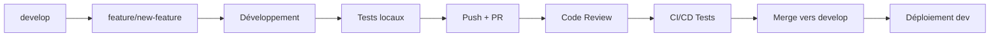

# Stratégie de Branching - Projet Coko

## Vue d'Ensemble

Nous utilisons une stratégie **GitFlow modifiée** adaptée aux microservices, optimisée pour les déploiements continus et la collaboration en équipe.

---

## Structure des Branches

### Branches Principales

```
main (production)
├── develop (intégration)
├── release/v1.0.0 (préparation release)
├── hotfix/critical-bug (corrections urgentes)
└── feature/auth-jwt (nouvelles fonctionnalités)
```

### 1. Branch `main`

**Rôle :** Code de production stable

```bash
# Caractéristiques
- Toujours déployable
- Code testé et validé
- Tags de version (v1.0.0, v1.1.0, etc.)
- Protection maximale
```

**Règles :**
- ❌ Pas de commits directs
- ✅ Merge uniquement depuis `release/*` ou `hotfix/*`
- ✅ Tous les tests doivent passer
- ✅ Review obligatoire par 2+ personnes
- ✅ Déploiement automatique en production

### 2. Branch `develop`

**Rôle :** Intégration continue des fonctionnalités

```bash
# Caractéristiques
- Code en cours de développement
- Intégration des features
- Tests automatiques
- Déploiement en environnement de développement
```

**Règles :**
- ✅ Merge depuis `feature/*`
- ✅ Tests automatiques obligatoires
- ✅ Review par 1+ personne
- ✅ Déploiement automatique en dev

### 3. Branches `feature/*`

**Rôle :** Développement de nouvelles fonctionnalités

```bash
# Convention de nommage
feature/service-functionality
feature/auth-jwt-implementation
feature/catalog-search-elasticsearch
feature/payment-orange-money
feature/reading-offline-sync
```

**Cycle de vie :**
```bash
# Création
git checkout develop
git pull origin develop
git checkout -b feature/auth-jwt-implementation

# Développement
git add .
git commit -m "feat(auth): implement JWT authentication"
git push origin feature/auth-jwt-implementation

# Merge vers develop
# Via Pull Request avec review
```

### 4. Branches `release/*`

**Rôle :** Préparation des versions de production

```bash
# Convention de nommage
release/v1.0.0
release/v1.1.0
release/v2.0.0-beta
```

**Processus :**
```bash
# Création depuis develop
git checkout develop
git pull origin develop
git checkout -b release/v1.0.0

# Finalisation (bug fixes, documentation)
git commit -m "chore(release): prepare v1.0.0"

# Merge vers main ET develop
git checkout main
git merge release/v1.0.0
git tag v1.0.0
git checkout develop
git merge release/v1.0.0
```

### 5. Branches `hotfix/*`

**Rôle :** Corrections urgentes en production

```bash
# Convention de nommage
hotfix/critical-security-patch
hotfix/payment-gateway-fix
hotfix/auth-token-expiry
```

**Processus :**
```bash
# Création depuis main
git checkout main
git pull origin main
git checkout -b hotfix/critical-security-patch

# Correction
git commit -m "fix(auth): patch critical security vulnerability"

# Merge vers main ET develop
git checkout main
git merge hotfix/critical-security-patch
git tag v1.0.1
git checkout develop
git merge hotfix/critical-security-patch
```

---

## Workflow Détaillé

### 1. Développement d'une Feature



**Étapes détaillées :**

```bash
# 1. Synchronisation
git checkout develop
git pull origin develop

# 2. Création de la branche
git checkout -b feature/catalog-advanced-search

# 3. Développement
# ... code ...
git add .
git commit -m "feat(catalog): add advanced search with filters"

# 4. Push et PR
git push origin feature/catalog-advanced-search
# Créer PR sur GitHub : feature/catalog-advanced-search → develop

# 5. Après review et merge
git checkout develop
git pull origin develop
git branch -d feature/catalog-advanced-search
```

### 2. Préparation d'une Release

```bash
# 1. Création de la branche release
git checkout develop
git pull origin develop
git checkout -b release/v1.2.0

# 2. Finalisation
# - Mise à jour CHANGELOG.md
# - Bump version dans package.json
# - Tests finaux
# - Documentation

git commit -m "chore(release): prepare v1.2.0"
git push origin release/v1.2.0

# 3. Tests en staging
# Déploiement automatique en staging
# Tests d'acceptation
# Validation produit

# 4. Merge vers main
# PR: release/v1.2.0 → main
# Après validation et merge:
git checkout main
git pull origin main
git tag v1.2.0
git push origin v1.2.0

# 5. Merge vers develop
git checkout develop
git merge main
git push origin develop

# 6. Nettoyage
git branch -d release/v1.2.0
```

### 3. Hotfix Critique

```bash
# 1. Création depuis main
git checkout main
git pull origin main
git checkout -b hotfix/payment-critical-fix

# 2. Correction rapide
# ... fix ...
git commit -m "fix(payment): resolve critical payment processing issue"
git push origin hotfix/payment-critical-fix

# 3. Tests urgents
# Tests automatiques
# Tests manuels critiques

# 4. Merge vers main
# PR urgent: hotfix/payment-critical-fix → main
git checkout main
git merge hotfix/payment-critical-fix
git tag v1.2.1
git push origin v1.2.1

# 5. Merge vers develop
git checkout develop
git merge main
git push origin develop

# 6. Déploiement immédiat
# Déploiement automatique en production
```

---

## Conventions de Nommage

### Branches

```bash
# Features
feature/service-functionality
feature/auth-social-login
feature/catalog-recommendation-engine
feature/payment-wave-integration

# Releases
release/v{major}.{minor}.{patch}
release/v1.0.0
release/v2.1.0
release/v1.0.0-beta.1

# Hotfixes
hotfix/description
hotfix/auth-token-validation
hotfix/database-connection-pool

# Bugfixes (pour develop)
bugfix/issue-description
bugfix/catalog-search-performance

# Chores (maintenance)
chore/dependency-updates
chore/documentation-update
```

### Tags

```bash
# Versions de production
v1.0.0      # Release majeure
v1.1.0      # Release mineure
v1.1.1      # Patch/Hotfix

# Versions de pré-production
v2.0.0-alpha.1
v2.0.0-beta.1
v2.0.0-rc.1
```

---

## Règles de Protection

### Branch `main`

```yaml
Protection_Rules:
  required_status_checks:
    - "ci/tests-backend"
    - "ci/tests-frontend"
    - "ci/security-scan"
    - "ci/performance-tests"
    - "ci/e2e-tests"
  
  required_pull_request_reviews:
    required_approving_review_count: 2
    dismiss_stale_reviews: true
    require_code_owner_reviews: true
    required_review_from_codeowners: true
  
  enforce_admins: true
  allow_force_pushes: false
  allow_deletions: false
  
  restrictions:
    push: []
    merge: ["coko-admins", "tech-leads"]
```

### Branch `develop`

```yaml
Protection_Rules:
  required_status_checks:
    - "ci/tests-backend"
    - "ci/tests-frontend"
    - "ci/lint"
  
  required_pull_request_reviews:
    required_approving_review_count: 1
    dismiss_stale_reviews: true
  
  allow_force_pushes: false
  
  restrictions:
    push: ["coko-developers"]
    merge: ["coko-developers"]
```

### Branches `release/*`

```yaml
Protection_Rules:
  required_status_checks:
    - "ci/tests-backend"
    - "ci/tests-frontend"
    - "ci/security-scan"
    - "ci/integration-tests"
  
  required_pull_request_reviews:
    required_approving_review_count: 2
    require_code_owner_reviews: true
  
  restrictions:
    push: ["coko-admins", "release-managers"]
```

---

## Automatisation CI/CD

### Déclencheurs par Branch

```yaml
CI_CD_Triggers:
  main:
    - Full test suite
    - Security scan
    - Performance tests
    - Build production images
    - Deploy to production
    - Create GitHub release
    - Update documentation
  
  develop:
    - Unit tests
    - Integration tests
    - Lint checks
    - Build dev images
    - Deploy to development
    - Update dev documentation
  
  feature/*:
    - Unit tests
    - Lint checks
    - Security scan (basic)
    - Build feature images
    - Deploy to feature environment (optional)
  
  release/*:
    - Full test suite
    - Security scan
    - Performance tests
    - Build staging images
    - Deploy to staging
    - Generate release notes
  
  hotfix/*:
    - Critical tests only
    - Security scan
    - Build hotfix images
    - Deploy to staging (fast track)
```

---

## Gestion des Conflits

### Stratégies de Merge

```bash
# 1. Feature → Develop : Squash and Merge
git checkout develop
git merge --squash feature/new-feature
git commit -m "feat(service): add new feature"

# 2. Release → Main : Merge Commit
git checkout main
git merge --no-ff release/v1.0.0

# 3. Hotfix → Main : Merge Commit
git checkout main
git merge --no-ff hotfix/critical-fix
```

### Résolution de Conflits

```bash
# 1. Synchronisation avant merge
git checkout feature/my-feature
git fetch origin
git rebase origin/develop

# 2. Résolution manuelle si conflits
# Éditer les fichiers en conflit
git add .
git rebase --continue

# 3. Force push (attention !)
git push --force-with-lease origin feature/my-feature
```

---

## Workflow par Équipe

### Backend Team

```bash
# Workflow typique
1. git checkout develop
2. git pull origin develop
3. git checkout -b feature/auth-microservice
4. # Développement du microservice
5. git commit -m "feat(auth): implement user authentication"
6. git push origin feature/auth-microservice
7. # Créer PR avec tests et documentation
8. # Review par un autre dev backend
9. # Merge après validation CI/CD
```

### Frontend Team

```bash
# Workflow typique
1. git checkout develop
2. git pull origin develop
3. git checkout -b feature/login-ui
4. # Développement de l'interface
5. git commit -m "feat(ui): add login form component"
6. git push origin feature/login-ui
7. # Créer PR avec screenshots et tests
8. # Review par designer + dev frontend
9. # Merge après validation
```

### DevOps Team

```bash
# Workflow infrastructure
1. git checkout develop
2. git pull origin develop
3. git checkout -b chore/kubernetes-monitoring
4. # Mise à jour infrastructure
5. git commit -m "chore(k8s): add prometheus monitoring"
6. git push origin chore/kubernetes-monitoring
7. # Créer PR avec tests d'infrastructure
8. # Review par tech lead + security
9. # Merge après validation
```

---

## Métriques et Monitoring

### KPIs Git

```yaml
Metrics_to_Track:
  branch_metrics:
    - average_feature_branch_lifetime
    - number_of_active_branches
    - merge_frequency
    - conflict_rate
  
  code_quality:
    - pull_request_size (lines changed)
    - review_time
    - approval_rate
    - revert_rate
  
  deployment_metrics:
    - deployment_frequency
    - lead_time_for_changes
    - mean_time_to_recovery
    - change_failure_rate
```

### Dashboards

```yaml
Dashboards:
  github_insights:
    - Pull request metrics
    - Code review analytics
    - Branch protection compliance
  
  custom_metrics:
    - Feature delivery time
    - Hotfix frequency
    - Release cycle time
    - Team productivity
```

---

## Bonnes Pratiques

### ✅ À Faire

1. **Branches courtes** : Limiter la durée de vie des features
2. **Commits atomiques** : Un commit = une fonctionnalité/fix
3. **Messages clairs** : Suivre les conventions de commit
4. **Tests systématiques** : Tous les changements doivent être testés
5. **Reviews obligatoires** : Pas de merge sans review
6. **Synchronisation régulière** : Rebase fréquent sur develop
7. **Documentation** : Mettre à jour la doc avec les changements

### ❌ À Éviter

1. **Commits directs sur main/develop**
2. **Branches de longue durée** (>1 semaine)
3. **Force push sur branches partagées**
4. **Merge sans tests**
5. **Messages de commit vagues**
6. **Ignorer les conflits**
7. **Skipper les reviews**

---

## Outils et Intégrations

### GitHub Actions

```yaml
# .github/workflows/branch-protection.yml
name: Branch Protection
on:
  pull_request:
    branches: [main, develop]

jobs:
  validate:
    runs-on: ubuntu-latest
    steps:
      - uses: actions/checkout@v3
      - name: Validate branch naming
        run: |
          if [[ "${{ github.head_ref }}" =~ ^(feature|bugfix|hotfix|chore)/.+ ]]; then
            echo "✅ Branch name is valid"
          else
            echo "❌ Branch name must follow pattern: type/description"
            exit 1
          fi
```

### Git Hooks

```bash
# .git/hooks/pre-commit
#!/bin/bash
# Vérification avant commit

# Lint check
npm run lint
if [ $? -ne 0 ]; then
  echo "❌ Lint errors found. Please fix before committing."
  exit 1
fi

# Tests unitaires
npm run test:unit
if [ $? -ne 0 ]; then
  echo "❌ Unit tests failed. Please fix before committing."
  exit 1
fi

echo "✅ Pre-commit checks passed"
```

---

## Formation Équipe

### Checklist Onboarding

```markdown
- [ ] Cloner le repository
- [ ] Configurer Git (nom, email, GPG)
- [ ] Installer les hooks Git
- [ ] Comprendre la stratégie de branching
- [ ] Faire un premier PR de test
- [ ] Configurer l'IDE avec les standards
- [ ] Accès aux environnements de dev
```

### Ressources

- **Documentation** : `/docs/git-workflow.md`
- **Vidéo formation** : Enregistrement de la session
- **Cheat sheet** : Commandes Git essentielles
- **Support** : Canal Slack #git-support

---

*Cette stratégie sera mise à jour selon les retours de l'équipe.*